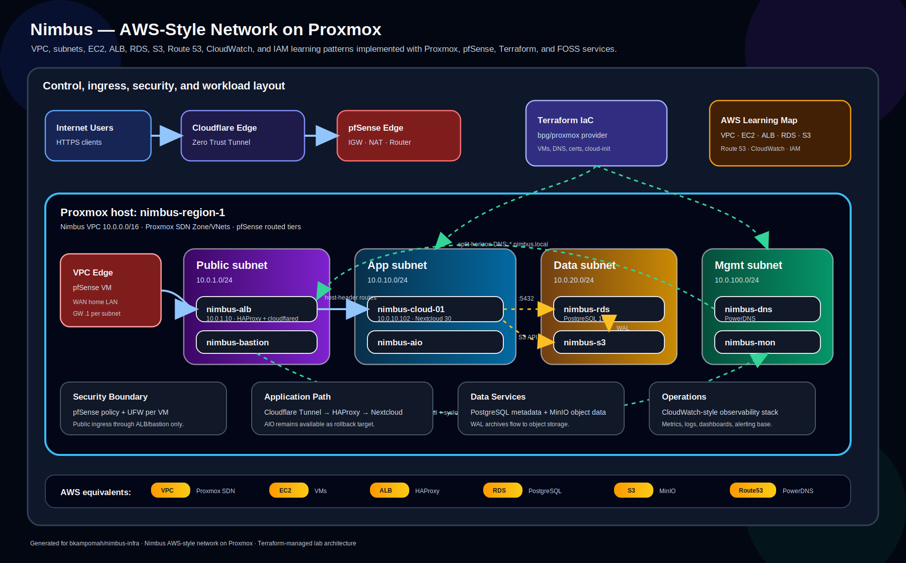

# Nimbus — AWS-Style Network on Proxmox

A learning project that recreates an AWS-style multi-tier network (VPC, subnets, security groups, EC2, ELB, RDS, S3, Route 53) on a Proxmox cluster, managed as code with Terraform.

> **Credentials (lab only):** admin username `nimbus`, password in `terraform.tfvars` (`admin_password`). Nextcloud admin password is `nextcloud_admin_password`. Switch to SSH keys and rotate before exposing anything beyond Cloudflare Tunnel.

---

## Architecture diagram



---


**Public access:**
- `https://cloud.nimbusnode.org` → Cloudflare Tunnel → nimbus-alb → nimbus-cloud-01:80
- `https://aio.nimbusnode.org` → Cloudflare Tunnel → nimbus-alb → nimbus-aio:11000
- `https://auth.nimbusnode.org` → Cloudflare Tunnel → nimbus-alb → nimbus-iam:8443

**Internal access:**
- `https://cloud-app.nimbus.local` → nimbus-alb:443 (self-CA TLS) → nimbus-cloud-01
- `https://cloud.nimbus.local` → nimbus-alb:443 (self-CA TLS) → nimbus-aio rollback backend
- `https://mon.nimbus.local` and `https://auth.nimbus.local` → nimbus-alb:443 (self-CA TLS)
- `https://vault.nimbus.local:8200` → direct to nimbus-vault via Tailscale/mgmt access

See `ARCHITECTURE.md` for the full AWS-to-Proxmox mapping.

---

## AWS → Proxmox/FOSS service map

| AWS                 | Nimbus equivalent                             | Status   |
|---------------------|-----------------------------------------------|----------|
| Region / AZ         | Proxmox datacenter / node                     | ✅       |
| VPC                 | Proxmox SDN Zone (`nimbus-vpc`, 10.0.0.0/16)  | ✅       |
| Subnet              | SDN VNet + subnet (4 tiers)                   | ✅       |
| Internet Gateway    | pfSense WAN interface                         | ✅       |
| NAT Gateway         | pfSense outbound NAT                          | ✅       |
| Route Table         | pfSense routing                               | ✅       |
| Security Group      | UFW per-VM (cloud-init) + Proxmox firewall    | ✅       |
| EC2 instance        | Proxmox VM (cloud-init, cloned from template) | ✅       |
| AMI                 | VM template 9000 (Ubuntu 24.04 cloud image)   | ✅       |
| S3                  | MinIO (`nimbus-s3`)                           | ✅       |
| RDS                 | PostgreSQL 16 VM (`nimbus-rds`)               | ✅       |
| Route 53            | PowerDNS (`nimbus-dns`, auth + recursor)      | ✅       |
| ELB / ALB           | HAProxy 2.8 (`nimbus-alb`)                    | ✅       |
| ACM / TLS certs     | Let's Encrypt (public) + step-ca (internal)   | ✅       |
| CloudFront / CDN    | Cloudflare Tunnel (zero-trust ingress)        | ✅       |
| CloudWatch          | Prometheus + Grafana + Loki (`nimbus-mon`)    | ✅ Phase 6 |
| Cognito / IAM IdP   | Keycloak (`nimbus-iam`)                       | ✅ Phase 7 |
| Secrets Manager / STS | HashiCorp Vault (`nimbus-vault`)            | ✅ Phase 7 |

---

## Phases

### ✅ Phase 0 — Prereqs (manual, one-time)
- Proxmox VE 8.x installed
- Proxmox API token for Terraform
- Ubuntu 24.04 cloud image downloaded, template VM 9000 built
- pfSense deployed with 5 interfaces (WAN + one per subnet)

### ✅ Phase 1 — Network foundation
- Proxmox SDN Zone `nimbus-vpc` + 4 VNets configured manually
- pfSense as IGW + NAT + firewall
- pfSense WAN kept default-deny; public app ingress is added later through Cloudflare Tunnel

### ✅ Phase 2 — AIO integration (legacy/reference app)
- Pre-existing Nextcloud AIO VM dual-homed into `nimbus-app` at `10.0.10.101`
- AIO return route and Apache binding configured so Nimbus services can reach it
- Kept as rollback/reference after Phase 5 built the managed Nextcloud stack

### ✅ Phase 3 — DNS (Route 53 equivalent)
- nimbus-dns deployed with PowerDNS authoritative (`nimbus.local`, `nimbusnode.org`) plus recursor
- Backend is currently PostgreSQL `gpgsql` on nimbus-rds after Phase 8 hardening
- All VM A records managed by Terraform via `pan-net/powerdns` provider
- Split-horizon: `cloud.nimbusnode.org` and `aio.nimbusnode.org` resolve to ALB internally, Cloudflare externally

### ✅ Phase 4 — Load balancer (see ARCHITECTURE.md §15 for build guide)
- **4a** *(Medium)* — Split `compute.tf` into scoped files; delete Proxmox SG resources in favour of UFW; fix MinIO disk default
- **4b** *(Medium)* — `modules/haproxy/` written; nimbus-alb deployed with cloud-init; verified on `:80`
- **4c** *(Easy)* — HAProxy frontend + AIO backend configured; `cloud.nimbus.local` DNS flipped from AIO → ALB
- **4d** *(Trivial)* — Split-horizon verified; traffic flow documented; `phase-4-complete` tagged

### ✅ Phase 5 — Data + App Tier (see ARCHITECTURE.md §16 for complexity guide)
- **5a** *(Medium)* — PostgreSQL module: pg_hba, listen_addresses, nightly `pg-backup` dump pipeline to MinIO
- **5b** *(Easy)* — MinIO module: single-node on dedicated data disk; `mc.minio` client, buckets, and scoped service accounts
- **5c** *(Hard)* — Nextcloud app: `occ maintenance:install` automated in cloud-init; MinIO as S3 Primary Object Storage; nginx + PHP-FPM 8.3; TLS (LE wildcard + step-ca internal CA) on nimbus-alb
- **5d** *(Easy)* — ALB + DNS wiring: HAProxy backend for nimbus-cloud-01; PowerDNS A record; Cloudflare Tunnel (cloudflared on nimbus-alb, `protocol: http2`)
- **5e** *(Trivial)* — Cutover: Cloudflare CNAME flipped from AIO tunnel to ALB tunnel; AIO kept on `cloud.nimbus.local` for rollback

### ✅ Phase 6 — Observability
- `nimbus-mon` deployed on `10.0.100.20` (Prometheus + Grafana + Loki)
- `node-exporter` + `Promtail` on every VM via cloud-init
- Grafana at `mon.nimbus.local` (also proxied via nimbus-alb on `:443`)
- Loki receives syslog + auth.log streams from all hosts

### ✅ Phase 7 — IAM (see `docs/phases/phase-7-iam.md` for build guide)
- **7a** *(Medium)* — `modules/keycloak/` + `modules/vault/`; `nimbus-iam` (10.0.100.30) and `nimbus-vault` (10.0.100.40) on mgmt subnet; ALB backends; CF Tunnel for `auth.nimbusnode.org`
- **7b** *(Medium)* — Keycloak realm-as-code via `keycloak/keycloak`; OIDC clients for nextcloud, grafana, minio-console, vault; nightly realm export to MinIO
- **7c** *(Easy–Medium)* — App SSO config rendered for Nextcloud `user_oidc`, Grafana `generic_oauth`, MinIO console OIDC; local admins kept as break-glass
- **7d** *(Hard)* — Vault bootstrap: raft storage, Shamir 3-of-5 unseal, audit log → Loki, KV v2 + database engines, OIDC auth via Keycloak
- **7e** *(Medium)* — Secret migration: cloudflared / powerdns / nextcloud creds → Vault KV; Postgres app creds → Vault dynamic database engine
- **7f** *(Trivial)* — README/service-map updates; Vault init + secret rotation runbooks; remaining hardening completed in Phase 8

### ✅ Phase 8 — IaC hardening (see `docs/phases/phase-8-iac-hardening.md` for completion record)
- Grafana 13 datasource/dashboard provisioning repaired; `nimbus-mon` now loads the `Nimbus` dashboard folder from repo JSON
- Promtail log permissions and Nextcloud Vault Agent runtime fixes are in IaC; live VMs were manually synced
- Nextcloud Vault dynamic DB role fixed and verified with a fresh credential rotation
- Keycloak admin recovery and OIDC client rotation runbooks added
- Backup pipelines hardened in IaC: `pg-backup`, Keycloak realm export, explicit `mc.minio` config, static-IP RDS output
- PowerDNS migrated from SQLite to `gpgsql` on nimbus-rds; DNS record replay verified
- MinIO: VPC-only API allowlist kept in IaC, console SSO moved to Keycloak group claims, `pg-backups` object lock and default `COMPLIANCE 30d` retention verified
- Linux admin identity standardized on `nimbus`; `scripts/smoke-test.sh` covers post-rebuild verification
- Tailscale ACL codified in `.github/tailscale-acl.hujson`; GitHub Actions tests on PRs and applies on `main`
- Live Phase 8 verification passed on 2026-05-13: `scripts/smoke-test.sh` reported 52 pass, 0 warn, 0 skip, 0 fail

---

## Repository layout

```
nimbus-infra/
├── README.md                        ← you are here
├── ARCHITECTURE.md                  ← AWS-to-Proxmox mapping in depth
├── NOTES.md                         ← lab journal, gotchas, decisions
├── .github/
│   ├── tailscale-acl.hujson         ← Tailscale tailnet policy for Nimbus admin access
│   └── workflows/                   ← CI: Terraform and Tailscale policy checks
├── scripts/
│   └── update-upgrade.sh            ← utility: apt update + upgrade all VMs
├── terraform/
│   ├── providers.tf                 ← bpg/proxmox, powerdns, tls, random
│   ├── variables.tf                 ← all inputs (CHANGE_ME items called out)
│   ├── terraform.tfvars.example     ← copy to terraform.tfvars, fill in
│   ├── alb.tf                       ← nimbus-alb (HAProxy + cloudflared)
│   ├── bastion.tf                   ← nimbus-bastion (DMZ jumpbox)
│   ├── certs.tf                     ← Nimbus CA + ALB TLS cert (hashicorp/tls)
│   ├── cloud.tf                     ← nimbus-cloud-01 (Nextcloud module)
│   ├── dns.tf                       ← PowerDNS zones + A records
│   ├── instances.tf                 ← generic compute instance locals
│   ├── mon.tf                       ← nimbus-mon (Prometheus/Grafana/Loki)
│   ├── network.tf                   ← Proxmox firewall rules
│   ├── rds.tf                       ← nimbus-rds (PostgreSQL module)
│   ├── s3.tf                        ← nimbus-s3 (MinIO module)
│   ├── keycloak.tf                  ← nimbus-iam service wiring
│   ├── vault.tf                     ← nimbus-vault service wiring
│   └── modules/
│       ├── bastion/                 ← DMZ jumpbox module
│       ├── haproxy/                 ← ALB module (HAProxy + cloudflared)
│       ├── keycloak/                ← IAM module
│       ├── minio/                   ← S3 module
│       ├── monitoring/              ← nimbus-mon module (Prometheus + Grafana + Loki)
│       ├── nextcloud/               ← Nextcloud app-tier module
│       ├── postgres/                ← RDS module (PostgreSQL + pg-backup)
│       ├── powerdns/                ← DNS module
│       └── vault/                   ← Secrets module
└── docs/
    ├── images/
    │   └── nimbus_aws_proxmox_network_diagram.svg ← rendered architecture diagram
    ├── phases/
    │   ├── phase-1-foundation.md
    │   ├── phase-2-aio-integration.md
    │   ├── phase-3-dns.md
    │   ├── phase-3-dns-copy-paste.md
    │   ├── phase-4-alb.md
    │   ├── phase-7-iam.md           ← Phase 7 build guide
    │   └── phase-8-iac-hardening.md ← Phase 8 hardening completion record
    ├── reference/
    │   ├── ssh-config.txt           ← SSH config for all Nimbus hosts
    │   ├── haproxy-nextcloud.cfg.example
    │   └── nextcloud-cloudflare-tunnel.md
    └── runbooks/
        ├── internal-ca.md
        ├── grafana-dashboard.md
        ├── keycloak-admin-recovery.md
        ├── oidc-client-rotation.md
        ├── tailscale-acl.md
        ├── vault-init.md
        └── vault-secret-rotation.md
```

Local-only and generated paths are intentionally outside the map above:

- `terraform/.terraform/` — provider/module cache from `terraform init`.
- `terraform/backups/` — generated backup payloads that may contain lab data.
- `terraform/terraform.tfvars` and `terraform/terraform.tfstate*` — local inputs and state.
- `scripts/install-obs.sh` and `scripts/install-monitoring.sh` — ignored one-off bootstrap scripts; current functionality lives in module cloud-init templates.
- `.claude/`, `.codex/`, and `.agents/` — local AI/editor metadata for this workstation.

---

## Proxmox API token (do this first)

```bash
pveum user add terraform@pve --comment "Terraform service account"
pveum aclmod / -user terraform@pve -role PVEAdmin
pveum user token add terraform@pve tf-token --privsep 0
```

The `full-tokenid` (`terraform@pve!tf-token`) goes into `proxmox_api_token` in `terraform.tfvars`.

---

## Day-one commands

```bash
git clone git@github.com:<you>/nimbus-infra.git
cd nimbus-infra/terraform
cp terraform.tfvars.example terraform.tfvars
# edit terraform.tfvars — every CHANGE_ME is called out
terraform init
# then follow the staged bootstrap below
```

Bootstrap order matters — providers can't auth against services that don't exist yet:

```bash
# Stage 1: deploy data/monitoring prerequisites.
# This also brings up nimbus-s3 and nimbus-mon because nimbus-rds depends on them.
terraform apply -target=module.nimbus_rds

# Stage 2: deploy nimbus-dns after nimbus-rds has the PowerDNS gpgsql database.
terraform apply -target=module.nimbus_dns

# Stage 3: capture the generated PowerDNS API key
terraform output -raw nimbus_dns_api_key
# → paste into terraform.tfvars as powerdns_api_key

# Stage 4 (Phase 7+): bring up Keycloak before the keycloak provider authenticates.
# nimbus-iam takes ~3 min to finish first-boot (Java + Keycloak build).
terraform apply -target=module.nimbus_iam

# Stage 5 (Phase 7d): bring up Vault — but it'll be sealed.
terraform apply -target=module.nimbus_vault

# Stage 6: manual `vault operator init` + unseal. Capture keys to your
# operator machine, NOT this repo. See docs/runbooks/vault-init.md.

# Stage 7: full apply — Keycloak realm + Vault engines/policies/auth methods land.
export VAULT_ADDR=https://10.0.100.40:8200
export VAULT_TOKEN=<root-token-from-stage-6>
export VAULT_SKIP_VERIFY=true   # internal CA, or set VAULT_CACERT=./nimbus-ca.crt
terraform apply
```

---

## Day-two maintenance

- **Nextcloud version bump:** edit `NC_VERSION` in `terraform/modules/nextcloud/user-data.yml.tftpl`, then upgrade the running VM with `occ upgrade` (new VMs pick it up automatically on next rebuild).
- **LE cert renewal:** acme.sh auto-renews via cron on nimbus-alb; deploy hook reloads HAProxy.
- **step-ca cert renewal:** `step ca renew` on nimbus-alb before 2026-07-29, then `systemctl reload haproxy`.
- **Grafana dashboard:** `terraform/modules/monitoring/dashboards/nimbus-aws-infrastructure.json` is loaded into the `Nimbus` folder by provisioning; see `docs/runbooks/grafana-dashboard.md`.
- **Keycloak admin recovery:** reset `nimbus-admin` through the master break-glass admin; see `docs/runbooks/keycloak-admin-recovery.md`.
- **OIDC client rotation:** rotate one client at a time and push the new secret to the app; see `docs/runbooks/oidc-client-rotation.md`.
- **MinIO client naming:** use `/usr/local/bin/mc.minio --config-dir /root/.mc.minio`; do not rely on `/usr/bin/mc`, which can be Midnight Commander.
- **MinIO backup retention:** `pg-backups` is object-lock-enabled with default `COMPLIANCE 30d` retention; object lock must be present at bucket creation time.
- **Tailscale ACL GitOps:** update `.github/tailscale-acl.hujson`; PRs test the policy, merges to `main` apply it. See `docs/runbooks/tailscale-acl.md`.
- **Smoke test:** after rebuilds or live hardening, run `./scripts/smoke-test.sh` from the repo root.
- **Drift detection:** run `terraform plan` — any diff means manual changes have been made to VMs.
- **Secrets rotation:** rotate `tf-token` quarterly; update `terraform.tfvars`.

---

## What's explicitly NOT in Terraform (and why)

| Thing                      | Why not                                                        |
|----------------------------|----------------------------------------------------------------|
| Proxmox SDN zones/vnets    | Provider coverage is partial; set up once by hand              |
| pfSense config             | Use the pfSense UI + config.xml backup; WAN stays default-deny |
| acme.sh / LE cert issuance | Run once manually on nimbus-alb; auto-renews via cron          |
| cloudflared tunnel token   | Created in Cloudflare dashboard; stored in `terraform.tfvars`  |
| Tailscale subnet router LXC | Runs outside this Terraform repo; ACL policy is GitOps-managed |
