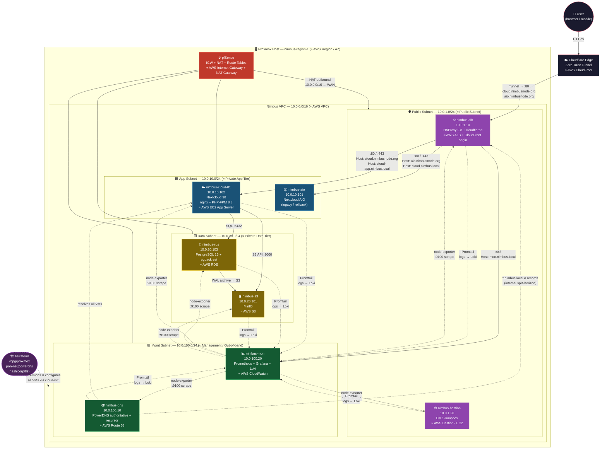

# Nimbus — AWS-Style Network on Proxmox

A learning project that recreates an AWS-style multi-tier network (VPC, subnets, security groups, EC2, ELB, RDS, S3, Route 53) on a Proxmox cluster, managed as code with Terraform.

> **Credentials (lab only):** admin username `nimbus`, password in `terraform.tfvars` (`admin_password`). Nextcloud admin password is `nextcloud_admin_password`. Switch to SSH keys and rotate before exposing anything beyond Cloudflare Tunnel.

---

## Current state



**Public access:**
- `https://cloud.nimbusnode.org` → Cloudflare Tunnel → nimbus-alb → nimbus-cloud-01:80
- `https://aio.nimbusnode.org` → Cloudflare Tunnel → nimbus-alb → nimbus-aio:11000

**Internal access:** `https://cloud.nimbus.local` or `https://mon.nimbus.local` → nimbus-alb:443 (self-CA TLS) → backend

See `ARCHITECTURE.md` for the full AWS-to-Proxmox mapping.

---

## AWS → Proxmox/FOSS service map

| AWS                 | Nimbus equivalent                             | Status   |
|---------------------|-----------------------------------------------|----------|
| Region / AZ         | Proxmox datacenter / node                     | ✅       |
| VPC                 | Proxmox SDN Zone (`nimbus-vpc`, 10.0.0.0/16)  | ✅       |
| Subnet              | SDN VNet + subnet (4 tiers)                   | ✅       |
| Internet Gateway    | pfSense WAN interface                         | ✅       |
| NAT Gateway         | pfSense outbound NAT                          | ✅       |
| Route Table         | pfSense routing                               | ✅       |
| Security Group      | UFW per-VM (cloud-init) + Proxmox firewall    | ✅       |
| EC2 instance        | Proxmox VM (cloud-init, cloned from template) | ✅       |
| AMI                 | VM template 9000 (Ubuntu 24.04 cloud image)   | ✅       |
| S3                  | MinIO (`nimbus-s3`)                           | ✅       |
| RDS                 | PostgreSQL 16 VM (`nimbus-rds`)               | ✅       |
| Route 53            | PowerDNS (`nimbus-dns`, auth + recursor)      | ✅       |
| ELB / ALB           | HAProxy 2.8 (`nimbus-alb`)                    | ✅       |
| ACM / TLS certs     | Let's Encrypt (public) + step-ca (internal)   | ✅       |
| CloudFront / CDN    | Cloudflare Tunnel (zero-trust ingress)        | ✅       |
| CloudWatch          | Prometheus + Grafana + Loki (`nimbus-mon`)    | ✅ Phase 6 |
| IAM                 | Keycloak + HashiCorp Vault                    | planned  |

---

## Phases

### ✅ Phase 0 — Prereqs (manual, one-time)
- Proxmox VE 8.x installed
- Proxmox API token for Terraform
- Ubuntu 24.04 cloud image downloaded, template VM 9000 built
- pfSense deployed with 5 interfaces (WAN + one per subnet)

### ✅ Phase 1 — Network foundation
- Proxmox SDN Zone `nimbus-vpc` + 4 VNets configured manually
- pfSense as IGW + NAT + firewall
- Port-forward 80/443 on pfSense WAN → nimbus-alb

### ✅ Phase 2 — Golden image
- Ubuntu 24.04 cloud-init template (VMID 9000)
- All VMs clone from this template via `bpg/proxmox` Terraform provider

### ✅ Phase 3 — DNS (Route 53 equivalent)
- nimbus-dns deployed with PowerDNS authoritative (`nimbus.local`, `nimbusnode.org`)
- All VM A records managed by Terraform via `pan-net/powerdns` provider
- Split-horizon: `cloud.nimbusnode.org` resolves to ALB internally, Cloudflare externally

### ✅ Phase 4 — Load balancer (see ARCHITECTURE.md §15 for build guide)
- **4a** *(Medium)* — Split `compute.tf` into scoped files; delete Proxmox SG resources in favour of UFW; fix MinIO disk default
- **4b** *(Medium)* — `modules/haproxy/` written; nimbus-alb deployed with cloud-init; verified on `:80`
- **4c** *(Easy)* — HAProxy frontend + AIO backend configured; `cloud.nimbus.local` DNS flipped from AIO → ALB
- **4d** *(Trivial)* — Split-horizon verified; traffic flow documented; `phase-4-complete` tagged

### ✅ Phase 5 — Data + App Tier (see ARCHITECTURE.md §15 for complexity guide)
- **5a** *(Medium)* — PostgreSQL module: pg_hba, listen_addresses, pgbackrest → MinIO WAL archive
- **5b** *(Easy)* — MinIO module: single-node on dedicated data disk; `mcli` alias + bucket + IAM user
- **5c** *(Hard)* — Nextcloud app: `occ maintenance:install` automated in cloud-init; MinIO as S3 Primary Object Storage; nginx + PHP-FPM 8.3; TLS (LE wildcard + step-ca internal CA) on nimbus-alb
- **5d** *(Easy)* — ALB + DNS wiring: HAProxy backend for nimbus-cloud-01; PowerDNS A record; Cloudflare Tunnel (cloudflared on nimbus-alb, `protocol: http2`)
- **5e** *(Trivial)* — Cutover: Cloudflare CNAME flipped from AIO tunnel to ALB tunnel; AIO kept on `cloud.nimbus.local` for rollback

### ✅ Phase 6 — Observability
- `nimbus-mon` deployed on `10.0.100.20` (Prometheus + Grafana + Loki)
- `node-exporter` + `Promtail` on every VM via cloud-init
- Grafana at `mon.nimbus.local` (also proxied via nimbus-alb on `:443`)
- Loki receives syslog + auth.log streams from all hosts

### 🔲 Phase 7 — IAM
- Keycloak (OIDC identity provider)
- HashiCorp Vault (secrets + dynamic DB credentials)

---

## Repository layout

```
nimbus-infra/
├── README.md                        ← you are here
├── ARCHITECTURE.md                  ← AWS-to-Proxmox mapping in depth
├── NOTES.md                         ← lab journal, gotchas, decisions
├── PHASE7.md                        ← upcoming IaC cleanup notes
├── scripts/
│   └── update-upgrade.sh            ← utility: apt update + upgrade all VMs
├── terraform/
│   ├── providers.tf                 ← bpg/proxmox, powerdns, tls, random
│   ├── variables.tf                 ← all inputs (CHANGE_ME items called out)
│   ├── terraform.tfvars.example     ← copy to terraform.tfvars, fill in
│   ├── alb.tf                       ← nimbus-alb (HAProxy + cloudflared)
│   ├── bastion.tf                   ← nimbus-bastion (DMZ jumpbox)
│   ├── certs.tf                     ← Nimbus CA + ALB TLS cert (hashicorp/tls)
│   ├── cloud.tf                     ← nimbus-cloud-01 (Nextcloud module)
│   ├── dns.tf                       ← PowerDNS zones + A records
│   ├── instances.tf                 ← generic compute instance locals
│   ├── mon.tf                       ← nimbus-mon (Prometheus/Grafana/Loki)
│   ├── network.tf                   ← Proxmox firewall rules
│   ├── rds.tf                       ← nimbus-rds (PostgreSQL module)
│   ├── s3.tf                        ← nimbus-s3 (MinIO module)
│   └── modules/
│       ├── bastion/                 ← DMZ jumpbox module
│       ├── haproxy/                 ← ALB module (HAProxy + cloudflared)
│       ├── minio/                   ← S3 module
│       ├── monitoring/              ← nimbus-mon module (Prometheus + Grafana + Loki)
│       ├── nextcloud/               ← Nextcloud app-tier module
│       ├── postgres/                ← RDS module (PostgreSQL + pgbackrest)
│       └── powerdns/                ← DNS module
└── docs/
    ├── ssh-config.txt               ← SSH config for all Nimbus hosts
    ├── haproxy-nextcloud.cfg.example← Reference HAProxy config (pre-Terraform)
    ├── nextcloud-cloudflare-tunnel.md ← Cloudflare Tunnel topology notes
    └── runbooks/
        └── internal-ca.md           ← Step-ca setup and cert renewal
```

---

## Proxmox API token (do this first)

```bash
pveum user add terraform@pve --comment "Terraform service account"
pveum aclmod / -user terraform@pve -role PVEAdmin
pveum user token add terraform@pve tf-token --privsep 0
```

The `full-tokenid` (`terraform@pve!tf-token`) goes into `proxmox_api_token` in `terraform.tfvars`.

---

## Day-one commands

```bash
git clone git@github.com:<you>/nimbus-infra.git
cd nimbus-infra/terraform
cp terraform.tfvars.example terraform.tfvars
# edit terraform.tfvars — every CHANGE_ME is called out
terraform init
terraform plan
terraform apply
```

Bootstrap order matters — DNS must exist before the PowerDNS provider can create records:

```bash
# Stage 1: deploy nimbus-dns VM only
terraform apply -target=module.nimbus_dns

# Stage 2: capture the generated API key
terraform output -raw nimbus_dns_api_key
# → paste into terraform.tfvars as powerdns_api_key

# Stage 3: full apply
terraform apply
```

---

## Day-two maintenance

- **Nextcloud version bump:** edit `NC_VERSION` in `terraform/modules/nextcloud/user-data.yml.tftpl`, then upgrade the running VM with `occ upgrade` (new VMs pick it up automatically on next rebuild).
- **LE cert renewal:** acme.sh auto-renews via cron on nimbus-alb; deploy hook reloads HAProxy.
- **step-ca cert renewal:** `step ca renew` on nimbus-alb before 2026-07-29, then `systemctl reload haproxy`.
- **Drift detection:** run `terraform plan` — any diff means manual changes have been made to VMs.
- **Secrets rotation:** rotate `tf-token` quarterly; update `terraform.tfvars`.

---

## What's explicitly NOT in Terraform (and why)

| Thing                      | Why not                                                        |
|----------------------------|----------------------------------------------------------------|
| Proxmox SDN zones/vnets    | Provider coverage is partial; set up once by hand              |
| pfSense config             | Use the pfSense UI + config.xml backup; port-forward 80/443    |
| acme.sh / LE cert issuance | Run once manually on nimbus-alb; auto-renews via cron          |
| cloudflared tunnel token   | Created in Cloudflare dashboard; stored in `terraform.tfvars`  |
| Grafana dashboards         | JSON files in repo, loaded via provisioning (Phase 6)          |
| OS-level config post-boot  | Use `occ`, `psql`, etc. directly; Terraform just lands the VM  |
