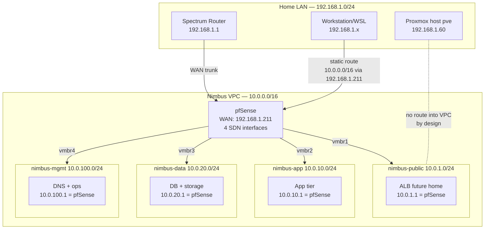

# Phase 1 — VPC Foundation

> The "build a VPC and a router" phase. Sets up the network plumbing that everything else lives inside.

## What's deployed

| Component | Where | Purpose |
|---|---|---|
| Proxmox SDN Zone `nimbus-vpc` | Datacenter → SDN | The VPC itself (10.0.0.0/16) |
| VNet `nimbus-public` | 10.0.1.0/24 | Public-facing subnet (ALB lives here) |
| VNet `nimbus-app` | 10.0.10.0/24 | Application tier subnet |
| VNet `nimbus-data` | 10.0.20.0/24 | Database/storage tier subnet |
| VNet `nimbus-mgmt` | 10.0.100.0/24 | Management subnet (DNS, monitoring, jumpbox) |
| pfSense VM (VMID 210) | 192.168.1.211 (WAN) + 4 SDN interfaces | Routes between subnets, firewalls inter-tier traffic |

## Architecture



### AWS equivalents

| Nimbus | AWS |
|---|---|
| Proxmox SDN Zone (`nimbus-vpc`) | VPC |
| Proxmox VNets | Subnets in different AZs |
| pfSense | Internet Gateway + NAT Gateway + Route Tables |
| pfSense firewall rules | NACLs (subnet-level) |
| Spectrum router | Your ISP edge — outside the VPC entirely |

## Verification

```bash
# 1. SDN zone applied?
ssh root@192.168.1.60 'pvesh get /cluster/sdn/zones'
# Expect: nimbus-vpc listed, type=simple

# 2. VNets exist?
ssh root@192.168.1.60 'pvesh get /cluster/sdn/vnets'
# Expect: nimbus-public, nimbus-app, nimbus-data, nimbus-mgmt

# 3. pfSense reachable from Workstation?
ping -c2 192.168.1.211

# 4. Routing into Nimbus works from Workstation?
ping -c2 10.0.100.1   # pfSense's mgmt interface

# 5. pfSense web UI loads?
# Browser: https://192.168.1.211 — should show pfSense login
```

If any of these fail, see Troubleshooting below.

## Operational tasks

### Add a new subnet
1. Proxmox UI → Datacenter → SDN → VNets → Create
2. Name `nimbus-<purpose>`, Zone `nimbus-vpc`, IPv4 prefix `10.0.<N>.0/24`
3. Apply SDN configuration (Datacenter → SDN → Apply)
4. Add a NIC to pfSense for the new VNet
5. In pfSense: Interfaces → assign the new NIC, set IP to 10.0.\<N\>.1/24
6. Add firewall rules on the new interface for inter-subnet traffic

### Modify firewall rules
- pfSense UI → Firewall → Rules → pick an interface
- **Always Save → Apply Changes**. Just clicking Save without Apply does nothing.
- For lab convenience, "any protocol, any source, any destination" allows everything; tighten later

### Backup pfSense config
- pfSense UI → Diagnostics → Backup & Restore → Download configuration as XML
- Strip `<password>` and `<apikey>` blocks before committing or sharing

## Common failures

### "I can't reach 10.0.x.x from my laptop"
Most likely cause: missing static route on Windows. Run from admin PowerShell:
```powershell
route -p add 10.0.0.0 mask 255.255.0.0 192.168.1.211
```
Verify: `route print -4 | findstr 10.0`

### "Ping works but TCP times out / "Connection refused""
pfSense firewall rule has wrong protocol. Check Firewall → Rules → \<interface\>:
- Protocol should usually be `any`, not `tcp`-only
- ICMP, UDP, and TCP each need allowing if you want all three

### "WSL can't ping but Windows can"
WSL is in NAT mode. Windows routes don't pass through. Either:
- Set `networkingMode=mirrored` in `~/.wslconfig` and `wsl --shutdown`, OR
- Test from Windows PowerShell directly when verifying lab work

### "Proxmox host can ping VMs in SDN VNets, but my workstation can't"
This is correct and expected. The Proxmox host has direct bridge access to SDN VNets but doesn't advertise routes. Workstations route through pfSense.

## Rebuild from scratch

This phase is mostly Proxmox UI clicks, not Terraform. High-level sequence:

1. Install Proxmox 8.x on bare metal
2. Datacenter → SDN → Zones → Create zone `nimbus-vpc`, type Simple
3. Datacenter → SDN → VNets → Create the four VNets above
4. Datacenter → SDN → Apply (this creates Linux bridges `vmbr1` through `vmbr4`)
5. Build pfSense VM (VMID 210):
   - 5 NICs: `vmbr0` (WAN, gets DHCP from Spectrum), then `vmbr1` through `vmbr4`
   - 4 GB RAM, 2 CPU, 20 GB disk
   - Boot pfSense ISO, run installer, assign interfaces
6. In pfSense web UI:
   - Set each LAN interface to its gateway IP (10.0.1.1, 10.0.10.1, etc.)
   - DHCP server enabled on each LAN interface with reasonable pools
   - Firewall: WAN allows HTTPS (8006) for Proxmox UI, blocks rest
   - Firewall: each LAN allows traffic out to anywhere (default), inter-subnet rules as needed
   - **Critical**: Protocol `any` on permissive rules (not `tcp`)
7. Reserve static IPs in pfSense DHCP for known infrastructure (DNS, ALB, etc.)
8. Add Windows static route as shown in Common Failures above

## Notes

- The Proxmox host (`pve`) sits at 192.168.1.60 on `vmbr0`. It is NOT a member of any SDN VNet and cannot reach VMs by their VPC IPs unless given a static route. This mirrors AWS where the hypervisor (the underlying compute) doesn't share an address space with the workloads.
- pfSense's WAN interface is on the home LAN (192.168.1.x) — not the public internet. Real WAN edge is your Spectrum router. pfSense is the "VPC edge" only.
- For real production use, replace pfSense with redundant gateways or route-based topology. For a single-host lab, pfSense is fine and well-supported.
