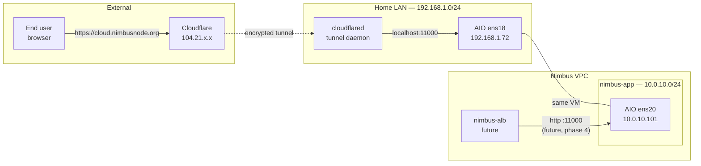

# Phase 2 — AIO Integration

> Bringing the pre-existing Nextcloud All-in-One into Nimbus without rebuilding it. Dual-homing to keep both Cloudflare Tunnel and the new VPC working simultaneously.

## What's deployed

| Component | Where | Purpose |
|---|---|---|
| Nextcloud AIO (VMID 106 `NextCloud3.0`) | 192.168.1.72 (ens18) + 10.0.10.101 (ens20) | Pre-existing all-in-one Nextcloud, now reachable from Nimbus |
| Cloudflare Tunnel | External | Already published `cloud.nimbusnode.org` to AIO via tunnel |
| pfSense rules | LAN_APP | Allow traffic from Nimbus VPC to reach AIO on 10.0.10.101 |

The AIO is a Docker-based all-in-one Nextcloud install (Apache, PHP, Postgres, Redis, ClamAV, Talk, Collabora — everything in one VM). It existed before Nimbus and is treated as legacy/reference, NOT as a Terraform-managed resource.

## Architecture



### AWS equivalents

| Nimbus | AWS |
|---|---|
| AIO with two NICs (ens18 + ens20) | EC2 with two ENIs, one per VPC |
| Cloudflare Tunnel | CloudFront + Lambda@Edge or ALB with WAF |
| Public-facing path stays via tunnel, internal via VPC | Real shops do exactly this — public via CDN, internal via VPC peering |

## Verification

```bash
# 1. AIO reachable on home LAN
ssh serveradmin@192.168.1.72 hostname
# Expect: nextcloud30 (or whatever you named it)

# 2. AIO reachable on nimbus-app subnet
ping -c2 10.0.10.101

# 3. From inside Nimbus, AIO Apache responds on port 11000
ssh nimbus@10.0.100.10 'curl -sI -m5 http://10.0.10.101:11000/' | head -3
# Expect: HTTP/1.1 302 Found, Location: https://cloud.nimbusnode.org/...

# 4. Cloudflare side still works
curl -sI https://cloud.nimbusnode.org | head -3
# Expect: HTTP/2 200 or 302

# 5. Critical: AIO's return route is in place (won't auto-recover if missing)
ssh serveradmin@192.168.1.72 'ip route | grep "10.0.0.0"'
# Expect: 10.0.0.0/16 via 10.0.10.1 dev ens20
```

## Operational tasks

### Update Nextcloud
1. Go to https://192.168.1.72:8080 — the AIO admin panel
2. Stop containers, run update, start containers
3. AIO handles Postgres / Apache / Redis upgrades atomically; it's why we kept it intact

### Add another internal hostname for the AIO
After Phase 3 DNS is in place:
```bash
# Use Terraform — never edit DNS on the VM directly
# In terraform/dns.tf, add to powerdns_record.infra:
"new-name.nimbus.local." = var.nimbus_aio_ip
# terraform apply
```

### Restart the AIO
```bash
ssh serveradmin@192.168.1.72 'sudo docker restart nextcloud-aio-mastercontainer'
# Wait ~2 min, then the Apache container will be back
```

### Backup
AIO has built-in BorgBackup. Configure via the AIO admin panel. **This is unrelated to Terraform** — backups of legacy infra are a separate concern.

## Common failures

### "Ping to 10.0.10.101 works, but ALB or any other Nimbus VM gets timeout / 'No route to host'"
This is the **classic return-route bug**. The AIO receives the packet but tries to reply via its default gateway (Spectrum at 192.168.1.1), which has no clue about 10.0.0.0/16. Fix:
```bash
ssh serveradmin@192.168.1.72 'cat /etc/netplan/60-nimbus-app.yaml'
# Should contain a routes block:
#   routes:
#     - to: 10.0.0.0/16
#       via: 10.0.10.1
# If missing, see Rebuild section below
sudo netplan apply
```

### "ens19 has no IP" or "ens20 has no IP"
Proxmox renames NICs sometimes. `ens19` was the original; after a NIC change it became `ens20`. To recover:
```bash
ssh serveradmin@192.168.1.72 'ip -4 link show'
# Find the actual name of the Nimbus NIC (the one without 192.168.1.x)
# Update /etc/netplan/60-nimbus-app.yaml to match
sudo netplan apply
```

### "Cloudflare Tunnel returns 502"
The AIO containers are down or restarting. Check:
```bash
ssh serveradmin@192.168.1.72 'sudo docker ps | grep nextcloud'
```
Look for `apache` and `nextcloud` containers in `Up` state. If down, restart via the AIO web UI.

### "Apache binding (APACHE_IP_BINDING) reverted to 127.0.0.1"
AIO updates sometimes reset this. Symptom: AIO works via Cloudflare but not from Nimbus.
1. Stop the mastercontainer
2. In Docker compose / mastercontainer env, set `APACHE_IP_BINDING=0.0.0.0`
3. Restart

## Rebuild from scratch

If the AIO is healthy and you only need to re-attach it to Nimbus:

1. **Add a NIC to the AIO VM via Proxmox UI**
   - VM 106 → Hardware → Add → Network Device
   - Bridge: `nimbus-app` (the SDN VNet)
   - Model: virtio

2. **Boot the VM, find the new interface name**
   ```bash
   ssh serveradmin@192.168.1.72
   ip -4 link show
   # Note the new interface name (likely ens19, ens20, ens21, etc.)
   ```

3. **Write netplan config**
   ```bash
   sudo tee /etc/netplan/60-nimbus-app.yaml > /dev/null <<'EOF'
   network:
     version: 2
     ethernets:
       ens20:                          # ← match what `ip link show` returned
         dhcp4: true
         dhcp4-overrides:
           use-routes: false           # don't take pfSense's default gateway
           use-dns: false              # don't take pfSense's DNS
         routes:
           - to: 10.0.0.0/16           # Nimbus VPC return route (CRITICAL)
             via: 10.0.10.1
         nameservers:
           addresses: [10.0.100.10]    # nimbus-dns
           search: [nimbus.local]
   EOF
   sudo chmod 600 /etc/netplan/60-nimbus-app.yaml
   sudo netplan apply
   ```

4. **Verify from Nimbus**
   ```bash
   # From any Nimbus VM, e.g. nimbus-dns
   ssh nimbus@10.0.100.10 'ping -c2 10.0.10.101'
   ```

5. **Configure AIO to listen on the new interface**
   - AIO web UI → APACHE_IP_BINDING set to `0.0.0.0`
   - Restart mastercontainer
   - Verify: `curl -sI -m5 http://10.0.10.101:11000/` from a Nimbus VM

## Tech debt and notes

- **The netplan file is NOT in code.** This is the single biggest piece of tech debt in the project. If the AIO VM is rebuilt, this config has to be re-applied manually. Document it, back it up, but don't pretend it's reproducible.
- **The AIO was deliberately not migrated to a managed Nextcloud stack.** That's Phase 5's job — and Phase 5 builds a *parallel* stack (Path B) rather than migrating this one.
- **Cloudflare Tunnel is unchanged.** External users continue to hit `cloud.nimbusnode.org` via Cloudflare's edge → tunnel → AIO Apache on localhost. Nimbus has no involvement in that path. This is split-architecture, not split-brain.
- **Apache binding** to 0.0.0.0 means the AIO listens for HTTP on all interfaces — both ens18 (for Cloudflare) and ens20 (for Nimbus). Fine for a lab. For prod, you'd bind explicitly to specific IPs.
