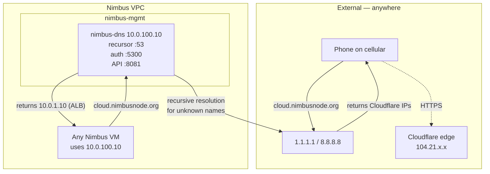

# Phase 3 — Internal DNS (PowerDNS)

> Internal name resolution for Nimbus services with split-horizon: same hostname returns different answers based on whether the resolver is inside or outside the VPC.

## What's deployed

| Component | Where | Purpose |
|---|---|---|
| nimbus-dns VM (VMID 111) | 10.0.100.10 in nimbus-mgmt | PowerDNS auth + recursor |
| PowerDNS auth (`pdns`) | 127.0.0.1:5300 on the VM | Authoritative for `nimbus.local`, `nimbusnode.org` |
| PowerDNS backend | `powerdns` database on nimbus-rds | Durable `gpgsql` storage for zones and records |
| PowerDNS recursor (`pdns-recursor`) | 0.0.0.0:53 on the VM | Client-facing; forwards external lookups, queries auth for internal |
| PowerDNS HTTP API | 0.0.0.0:8081 on the VM | Terraform manages records via this |
| Terraform-managed DNS records | In the auth zones | Internal hostnames for nimbus services |

Current-state note: Phase 3 introduced PowerDNS and split-horizon DNS. Phase 8
later moved the authoritative backend from SQLite to PostgreSQL `gpgsql` on
nimbus-rds; the table above reflects the current rebuilt state.

### Records currently managed

| Record | Resolves to | Why |
|---|---|---|
| `nimbus-dns.nimbus.local` | 10.0.100.10 | Self-reference |
| `nimbus-alb.nimbus.local` | 10.0.1.10 | Load balancer |
| `nimbus-cloud-aio.nimbus.local` | 10.0.10.101 | Direct AIO (bypass ALB if needed) |
| `cloud.nimbus.local` | 10.0.1.10 | User-facing — routes through ALB |
| `cloud.nimbusnode.org` (internal only) | 10.0.1.10 | Split-horizon: external goes to Cloudflare |
| `aio.nimbusnode.org` (internal only) | 10.0.1.10 | Split-horizon AIO path through ALB |
| `nimbus-rds.nimbus.local` | 10.0.20.103 | PostgreSQL |
| `nimbus-s3.nimbus.local` | 10.0.20.101 | MinIO |
| `auth.nimbus.local`, `auth.nimbusnode.org` | 10.0.1.10 | Keycloak through ALB |
| `vault.nimbus.local` | 10.0.100.40 | Vault |

## Architecture



The same hostname `cloud.nimbusnode.org` resolves to **different IPs** depending on where the query originates. That's split-horizon.

### AWS equivalents

| Nimbus | AWS |
|---|---|
| PowerDNS auth + recursor | Route 53 Resolver |
| `nimbus.local` zone | Route 53 Private Hosted Zone associated with VPC |
| `nimbusnode.org` records on the same auth | Route 53 Private Zone overriding public answers |
| Recursor forwarding to 1.1.1.1 | VPC DNS resolver default behavior |

## Verification

```bash
# 1. VM running
ssh root@192.168.1.60 'qm list | grep nimbus-dns'
# Expect: 111 nimbus-dns running

# 2. Both PowerDNS daemons up
ssh nimbus@10.0.100.10 'sudo systemctl is-active pdns pdns-recursor'
# Expect:
#   active
#   active

# 3. Recursor listening on :53
ssh nimbus@10.0.100.10 'sudo ss -ulnp | grep ":53"'
# Expect: 0.0.0.0:53 ... pdns_recursor

# 4. Internal name resolves
dig @10.0.100.10 nimbus-alb.nimbus.local +short
# Expect: 10.0.1.10

# 5. External name resolves (forwarding works)
dig @10.0.100.10 google.com +short
# Expect: real Google IPs

# 6. Split-horizon — internal answer
dig @10.0.100.10 cloud.nimbusnode.org +short
# Expect: 10.0.1.10 (the ALB)

# 7. Split-horizon — external answer (run from outside Nimbus)
dig @1.1.1.1 cloud.nimbusnode.org +short
# Expect: Cloudflare edge IPs (104.x, 172.x)

# 8. API reachable
curl -s -o /dev/null -w "HTTP:%{http_code}\n" http://10.0.100.10:8081/api/v1/servers
# Expect: HTTP:401 (good — means listening, just wants auth)

# 9. Auth backend is PostgreSQL, not SQLite
ssh nimbus@10.0.100.10 'sudo grep -E "^(launch|gpgsql-host|gpgsql-dbname|gpgsql-user)=" /etc/powerdns/pdns.conf'
# Expect: launch=gpgsql plus nimbus-rds connection settings

# 10. PostgreSQL backend contains zones and records
ssh nimbus@10.0.20.103 'sudo -u postgres psql -d powerdns -c "select count(*) as domains from domains; select count(*) as records from records;"'
# Expect: 2 domains and nonzero records
```

## Operational tasks

### Add a new DNS record
**Always via Terraform.** Don't edit on the VM directly — it'll drift and get reverted on next apply.

In `terraform/dns.tf`:
```hcl
# Add to powerdns_record.infra:
"new-host.nimbus.local." = "10.0.10.50"

# Or for nimbusnode.org records, add to powerdns_record.nimbusnode_internal:
"newthing.nimbusnode.org." = "10.0.1.50"
```

Then:
```bash
cd ~/code/nimbus-infra/terraform
terraform plan
# verify the diff
terraform apply
dig @10.0.100.10 new-host.nimbus.local +short  # verify
```

### Point clients at nimbus-dns
Already configured in pfSense DHCP for LAN_APP, LAN_DATA, LAN_MGMT. New VMs auto-pick it up.

For VMs with manual networking (like the AIO):
```yaml
# /etc/netplan/<file>.yaml
nameservers:
  addresses: [10.0.100.10]
  search: [nimbus.local]
```

### Check what zones exist
```bash
ssh nimbus@10.0.100.10 'sudo pdnsutil list-all-zones'
# Expect: nimbus.local. and nimbusnode.org.
```

### Manually inspect zone contents (for debugging)
```bash
ssh nimbus@10.0.100.10 'sudo pdnsutil list-zone nimbus.local'
```

### Rotate the API key
```bash
cd ~/code/nimbus-infra/terraform
terraform taint module.nimbus_dns.random_password.api_key
terraform apply -target=module.nimbus_dns
# This re-uploads the cloud-init snippet but the VM's pdns.conf
# won't pick it up without a rebuild. To actually rotate:
terraform apply -replace=module.nimbus_dns.proxmox_virtual_environment_vm.dns
```

## Common failures

### "dig times out — connection refused"
Recursor is dead or not listening. Check:
```bash
ssh nimbus@10.0.100.10 'sudo systemctl status pdns-recursor --no-pager | head -10'
```
Common causes:
- **systemd-resolved owns :53** — happens after some Ubuntu updates. Fix: `sudo systemctl disable --now systemd-resolved`
- **Recursor config syntax error** — check `journalctl -u pdns-recursor -n 30`. If "Incremental setting 'forward-zones' without a parent", the config used `+=` syntax without a base value.

### "dig times out — i/o timeout (NOT refused)"
Different problem — VM might be off, or pfSense routing broken. Check:
```bash
ping -c2 10.0.100.10                    # is host alive?
ssh root@192.168.1.60 'qm list | grep nimbus-dns'  # is VM running?
```
If the VM is `stopped`, start it: `qm start 111` and `qm set 111 --onboot 1`.

### "API returns 401 even with the right key"
Drift between Terraform state and the VM. The `pdns.conf` on the VM has a different `api-key=` than what Terraform thinks. Sync:
```bash
cd ~/code/nimbus-infra/terraform
terraform show -json | jq -r '.values.root_module.child_modules[]
  | select(.address=="module.nimbus_dns")
  | .resources[]
  | select(.address=="module.nimbus_dns.random_password.api_key")
  | .values.result' > /tmp/tf-key.txt
scp /tmp/tf-key.txt nimbus@10.0.100.10:/tmp/
ssh nimbus@10.0.100.10 'TF_KEY=$(cat /tmp/tf-key.txt) && sudo sed -i "s|^api-key=.*|api-key=$TF_KEY|" /etc/powerdns/pdns.conf && sudo systemctl restart pdns'
shred -u /tmp/tf-key.txt
```

### "API returns empty / 503 / hangs forever"
The auth server (`pdns`) crashed but the recursor is fine. With the Phase 8
`gpgsql` backend, common causes are a missing PostgreSQL schema, a bad backend
password in `/etc/powerdns/pdns.conf`, or nimbus-rds being unavailable. Check:
```bash
ssh nimbus@10.0.100.10 'sudo systemctl status pdns --no-pager | head -30'
ssh nimbus@10.0.100.10 'sudo grep -E "^(launch|gpgsql-host|gpgsql-dbname|gpgsql-user)=" /etc/powerdns/pdns.conf'
ssh nimbus@10.0.20.103 'sudo -u postgres psql -d powerdns -c "\dt"'
```

If the `powerdns` database exists but has no tables, initialize the schema and
replay Terraform-managed records:
```bash
ssh nimbus@10.0.100.10
sudo systemctl stop pdns
SCHEMA="$(find /usr/share -name schema.pgsql.sql | head -1)"
sudo install -o root -g root -m 0600 /dev/null /run/powerdns-db-pass
sudo editor /run/powerdns-db-pass   # paste the Terraform powerdns_db_password
sudo env PGPASSWORD="$(sudo cat /run/powerdns-db-pass)" \
  psql -h 10.0.20.103 -U powerdns -d powerdns -f "$SCHEMA"
sudo shred -u /run/powerdns-db-pass
sudo systemctl start pdns

# Then re-apply Terraform records from your workstation:
cd ~/code/nimbus-infra/terraform
terraform apply -target='powerdns_record.infra' \
                -target='powerdns_record.cloud_internal_cname' \
                -target='powerdns_record.nimbusnode_internal' \
                -target='powerdns_record.nimbus_bastion' \
                -target='powerdns_record.nimbus_rds' \
                -target='powerdns_record.nimbus_s3' \
                -target='powerdns_record.nimbus_iam_alb' \
                -target='powerdns_record.nimbus_iam_direct' \
                -target='powerdns_record.nimbus_iam_public_internal' \
                -target='powerdns_record.nimbus_vault'
```

### "API key works from VM (curl localhost) but not from WSL"
PowerDNS's `webserver-allow-from` ACL doesn't include your workstation's CIDR. The cloud-init template sets it via `mgmt_allow_cidrs` Terraform variable (which defaults to VPC + 192.168.0.0/16). If yours is wrong, edit `terraform/variables.tf` and re-apply.

## Rebuild from scratch

```bash
cd ~/code/nimbus-infra/terraform

# Stage 1: deploy data prerequisites first; nimbus-dns stores auth records in nimbus-rds
ssh-add ~/.ssh/id_ed25519   # bpg provider needs ssh-agent for snippet upload
terraform apply -target=module.nimbus_rds

# Stage 2: deploy the DNS VM (PowerDNS provider can't talk to itself yet)
terraform apply -target=module.nimbus_dns

# Wait ~5 minutes for cloud-init: install packages, init gpgsql schema on nimbus-rds,
# start services, seed zones
# Watch progress: ssh root@192.168.1.60 'qm terminal <VMID>'  -> "tail -f /var/log/cloud-init-output.log"

# Stage 3: now PowerDNS is up, manage records via the API
terraform apply -target='powerdns_record.infra' \
                -target='powerdns_record.cloud_internal_cname' \
                -target='powerdns_record.nimbusnode_internal'
```

If anything in cloud-init fails, the runbook fix is:
1. Read `/var/log/cloud-init-output.log` on the VM
2. Most common is one of: systemd-resolved conflict, gpgsql connectivity/schema, recursor config syntax — all addressed in the cloud-init template
3. Manual recovery follows the relevant "Common failures" section above

## Tech debt and notes

- **The cloud-init template went through 5 bug fixes** during initial deployment. Currently believed clean — would benefit from a fresh rebuild test someday to prove it.
- **Records are sensitive to the chicken-and-egg problem.** First apply must use `-target=module.nimbus_dns`, and nimbus-rds must already exist because `nimbus-dns` initializes its `gpgsql` schema there. Subsequent applies can be plain `terraform apply` because the API will be reachable.
- **The DNS VM has no HA.** If it dies, internal name resolution breaks for all of Nimbus. For a lab, fine. For prod, you'd run two recursors with VRRP/keepalived.
- **API key is in Terraform state**, which is at rest on your laptop. Encrypt the state at rest or use Terraform Cloud / S3-with-KMS for any real environment.
- **Forward-zones syntax** in recursor config is `forward-zones=zone1=ip,zone2=ip` (single line, comma-separated). Do NOT use `forward-zones+=...` append syntax — fails without a base.
