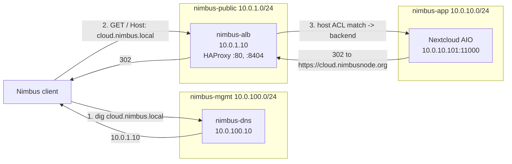

# Phase 4 — Application Load Balancer (HAProxy)

> An HTTP load balancer in the public subnet, fronting application services. Terminates and routes by Host header to backends. The "ALB" in the AWS sense.

## What's deployed

| Component | Where | Purpose |
|---|---|---|
| nimbus-alb VM (VMID 108) | 10.0.1.10 in nimbus-public | HAProxy load balancer |
| HAProxy frontend | :80 on the VM | Public-facing HTTP, host-based routing |
| HAProxy stats | :8404 on the VM | Live backend health, request metrics (mgmt subnet only) |
| Backend pool `nextcloud-aio` | 10.0.10.101:11000 | Forwards `cloud.nimbus.local` traffic to the AIO |
| DNS record (Phase 3) | `cloud.nimbus.local` → 10.0.1.10 | Routes user traffic through the ALB |
| UFW on the VM | per-subnet ACLs | :22 from mgmt, :80 from VPC, :8404 from mgmt |

### Phase 4 sub-phases

- **4a** — Scaffolding: split `compute.tf` into role-specific files, removed cluster firewall security groups (token lacks Sys.Modify), bumped MinIO module disk default
- **4b** — Built and deployed nimbus-alb, two PRs: HAProxy module, then DNS flip from AIO to ALB

## Architecture



### AWS equivalents

| Nimbus | AWS |
|---|---|
| nimbus-alb (HAProxy) | Application Load Balancer |
| HAProxy frontend ACLs | ALB Listener Rules |
| HAProxy backend pool | ALB Target Group |
| Health checks (`inter 5s fall 3 rise 2`) | Target Group health check |
| HAProxy stats page | ALB CloudWatch metrics |
| UFW per-VM | Security Group |

## Verification

```bash
# 1. VM running
ssh root@192.168.1.60 'qm list | grep nimbus-alb'
# Expect: 108 nimbus-alb running

# 2. HAProxy active
ssh nimbus@10.0.1.10 'sudo systemctl is-active haproxy'
# Expect: active

# 3. UFW rules
ssh nimbus@10.0.1.10 'sudo ufw status'
# Expect: 22 from mgmt, 80 from 10.0.0.0/16, 8404 from mgmt

# 4. Stats page reachable from VM itself
ssh nimbus@10.0.1.10 'curl -sf -o /dev/null -w "stats HTTP:%{http_code}\n" http://127.0.0.1:8404/'
# Expect: stats HTTP:200

# 5. Backend health from stats CSV
ssh nimbus@10.0.1.10 'curl -s "http://127.0.0.1:8404/;csv" | grep nextcloud-aio | awk -F, "{print \$1, \$2, \$18}"'
# Expect:
#   nextcloud-aio nextcloud-aio-01 UP
#   nextcloud-aio BACKEND UP

# 6. DNS routes through ALB
dig @10.0.100.10 cloud.nimbus.local +short
# Expect: 10.0.1.10

# 7. End-to-end traffic test (must be from inside Nimbus due to UFW)
ssh nimbus@10.0.100.10 'curl -sI http://cloud.nimbus.local/'
# Expect: HTTP/1.1 302 Found, Location: https://cloud.nimbusnode.org/login
```

## Operational tasks

### View HAProxy stats UI
From a workstation that can reach mgmt subnet (e.g. WSL with the static route):
```
http://10.0.1.10:8404/
```
Shows live request rate, backend health, queue depth. No auth — protected by UFW source CIDR only.

### Add a new backend
1. Add an entry to `terraform/alb.tf` in the `backends` list:
   ```hcl
   {
     name        = "wiki"
     host_match  = "wiki.nimbus.local"
     server_ip   = "10.0.10.50"
     server_port = 8080
     check       = true
   }
   ```
2. Add a corresponding DNS record in `terraform/dns.tf` for `wiki.nimbus.local` → `10.0.1.10`
3. `terraform apply` — Terraform updates the cloud-init snippet and re-renders HAProxy config

**Important**: the running VM doesn't auto-pick up snippet changes. To actually apply the new HAProxy config, either:
- Manually edit `/etc/haproxy/haproxy.cfg` on the VM and `systemctl reload haproxy`, OR
- Rebuild the VM: `terraform apply -replace=module.nimbus_alb.proxmox_virtual_environment_vm.alb`

### Update HAProxy config (live, no rebuild)
```bash
ssh nimbus@10.0.1.10
sudo nano /etc/haproxy/haproxy.cfg
sudo haproxy -c -f /etc/haproxy/haproxy.cfg   # validate FIRST
sudo systemctl reload haproxy                 # reload, no dropped connections
```

### Watch live logs
```bash
ssh nimbus@10.0.1.10 'sudo journalctl -u haproxy -f'
# Each request logs: timestamp, client IP, response code, backend, latency
```

### Drain a backend (graceful)
HAProxy has runtime controls via the admin socket:
```bash
ssh nimbus@10.0.1.10 'echo "disable server nextcloud-aio/nextcloud-aio-01" | sudo socat stdio /run/haproxy/admin.sock'
```
Existing connections finish; no new ones routed. Re-enable with `enable server`.

## Common failures

### "503 Service Unavailable on every request"
Backend health check is failing. Look at stats CSV:
```bash
ssh nimbus@10.0.1.10 'curl -s "http://127.0.0.1:8404/;csv" | grep nextcloud-aio'
```
Then `grep` columns 18 (status) and 73 (last check error). Most common reasons:
- **L4TOUT** = TCP timeout. Backend network unreachable. Check pfSense routing and AIO `ip route`.
- **L4CON** = Connection refused. Backend isn't listening on the port.
- **L7STS** = Backend returned an unexpected HTTP status. Tweak `http-check expect status` in HAProxy config.

### "No route to host" in HAProxy logs
Means the ALB can ping pfSense but pfSense can't deliver to the backend. The most common cause is the AIO missing its return route to 10.0.0.0/16. See Phase 2 runbook → Common Failures.

### "Connection timed out" from outside Nimbus when curl-ing :80
Expected. UFW only allows :80 from `10.0.0.0/16`. Test from inside Nimbus, or temporarily widen UFW:
```bash
ssh nimbus@10.0.1.10 'sudo ufw allow from 192.168.0.0/16 to any port 80 proto tcp'
```

### "Stats page returns 403 from WSL"
Same UFW issue, but for :8404. Stats is mgmt-only by design. Test from a Nimbus VM in mgmt subnet, or widen the rule temporarily.

### "DNS still returns the old IP after Terraform apply"
The PowerDNS provider replaces records (destroy + create) when the value changes. There's a brief window where the record doesn't exist, and DNS clients may cache for the TTL (5 min for `cloud.nimbus.local`). Wait or flush:
```bash
# Flush a Linux system's resolver cache
sudo systemd-resolve --flush-caches 2>/dev/null || sudo resolvectl flush-caches
# Or test directly with the authoritative server, bypassing cache:
dig @10.0.100.10 cloud.nimbus.local +short
```

### "terraform plan shows snippet drift"
"Object has changed outside of Terraform" means someone (or something) deleted the snippet file from `/var/lib/vz/snippets/`. Re-apply to recreate:
```bash
terraform apply -target=module.nimbus_alb.proxmox_virtual_environment_file.user_data
```
The running VM is unaffected — snippets are read-once at boot.

### "ssh-agent: no identities" when terraform apply tries to upload snippet
The bpg provider uses SSH (via ssh-agent) to upload snippets to Proxmox. Each new WSL shell starts agent fresh. Fix:
```bash
eval "$(ssh-agent -s)"
ssh-add ~/.ssh/id_ed25519
```
Or add the agent block to `~/.bashrc` to auto-load.

## Rebuild from scratch

```bash
cd ~/code/nimbus-infra/terraform

# Make sure ssh-agent has your key loaded
ssh-add -L | grep -q ssh-ed25519 || (eval "$(ssh-agent -s)" && ssh-add ~/.ssh/id_ed25519)

# Stage 1: deploy the ALB VM
terraform apply -target=module.nimbus_alb
# ~3-5 min: clone template, cloud-init installs HAProxy, configures UFW, starts daemon

# Stage 2: verify (see Verification section above) before flipping DNS

# Stage 3: flip DNS (or `terraform apply` if dns.tf already points at ALB)
terraform apply
```

If cloud-init fails, SSH in via console (`qm terminal 108`) and read `/var/log/cloud-init-output.log`. The bootstrap script logs each step.

## Tech debt and notes

- **Historical Phase 4 state:** the first ALB cut used HTTP only. Later phases added Cloudflare Tunnel ingress, Let's Encrypt public certs, and internal CA TLS on `:443`.
- **Stats page has no app-level auth.** It remains subnet-restricted via UFW.
- **Multiple backends now exist.** The module supports host-header routing for AIO, managed Nextcloud, Grafana, and Keycloak.
- **No autoscaling.** This is a single VM; it doesn't grow with traffic. For real autoscaling you'd need Kubernetes or multi-node Proxmox + keepalived. Out of scope for the homelab.
- **Health check `expect status 200,301,302,401`** because Nextcloud may return any of these on `GET /` depending on session state. If you add a backend that returns something else, widen this list in `modules/haproxy/user-data.yml.tftpl`.
- **Snippet → VM sync is manual.** `terraform apply` updates the snippet on Proxmox storage, but the running VM doesn't re-read it. Either edit live and reload HAProxy, or use `-replace` to rebuild the VM.
- **Static IP via cloud-init**, not DHCP reservation. The ALB needs a known IP because DNS records hardcode it. If you change the subnet, also update `var.nimbus_alb_ip`.
